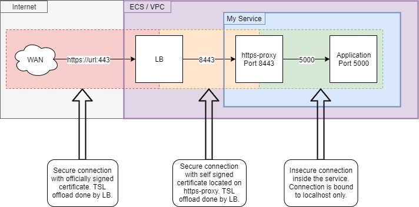

[](https://GitHub.com/Hapag-Lloyd/https-proxy/graphs/contributors/)
[](https://travis-ci.org/Hapag-Lloyd/https-proxy)

[](https://hub.docker.com/r/hlag/https-proxy)

# https-proxy
##### to secure application traffic behind the ssl terminating loadbalancer 



## Introduction

#### Goal

The goal of the https-proxy is to secure the application traffic
inside of the virtual network.<br>
The image was tested on an aws fargate cluster. The clusters LB
accepts self-signed certificates. This way the https-proxy can accept
encrypted traffic from the LB which already terminated the public
traffic encryption and re-encrypt it to be forwarded to your application.
<br>

## Usage

##### Important:
~~This setup only works on services like aws fargate where all containers
of a service are using the same shared network interface. This way
the incoming traffic can be forwarded by the proxy to
`localhost:PORT`. If you are using a service where every container
has it's own interface feel free to fork the source code and implement
your own solution. This should be done in `default.conf` and perhaps
in `Dockerfile` and / or `entrypoint.sh`.~~

The PORT variable was changed to `TARGET_HOST_PORT` which consists of the IP
(or hostname) and the port, separated by a colon (e.g. 127.0.0.1:5000). 

#### Configuring the LB
Configure your load balancer to forward all traffic to your application
on port 8443. This is necessary since only high-ports can be used
inside a fargate service.<br>
Make sure your ACLs and security groups do also match the new
set port.

#### Configuring your service
Configure your service to open only port 8443 on the public interface.
It's important to remove the previous port forwarding to your
applications port.<br>

#### Configuring the environment variable
To set your internal application port on the proxy container you have
to pass on the value as an environment variable `TARGET_HOST_PORT` e.g. `TARGET_HOST_PORT=127.0.0.1:5000`.
The https-proxy's `entrypoint.sh` script uses this variable to set the
required parameters in `default.conf`.

## Example

#### An aws ecs fargate example could look like this

##### task.tf
```hcl-terraform
resource "aws_ecs_task_definition" "task_definition" {
  ...
  container_definitions    = templatefile("./container_definition.json", {
    CONTAINER_PORT = 5000
  })
  ...
}
```

##### service.tf
```hcl-terraform
resource "aws_ecs_service" "aws_ecs_service" {
  ...
  load_balancer {
    container_name   = "myApp-https-proxy"
    container_port   = 8443
  }
  ...
}
```

##### container_definition.json
```json5
[
  {
    ...
    "name": "myApp",
    "image": "imageURL",
    ...
  },
  {
    ...
    "name": "myApp-https-proxy",
    "image": "hlag/https-proxy:latest",
    "portMappings": [
      {
        "containerPort": 8443,
        "protocol": "tcp"
      }
    ],
    "environment": [
      {
        "name": "TARGET_HOST_PORT",
        "value": "127.0.0.1:${CONTAINER_PORT}"
      }
    ],
    ...
  }
]
```
